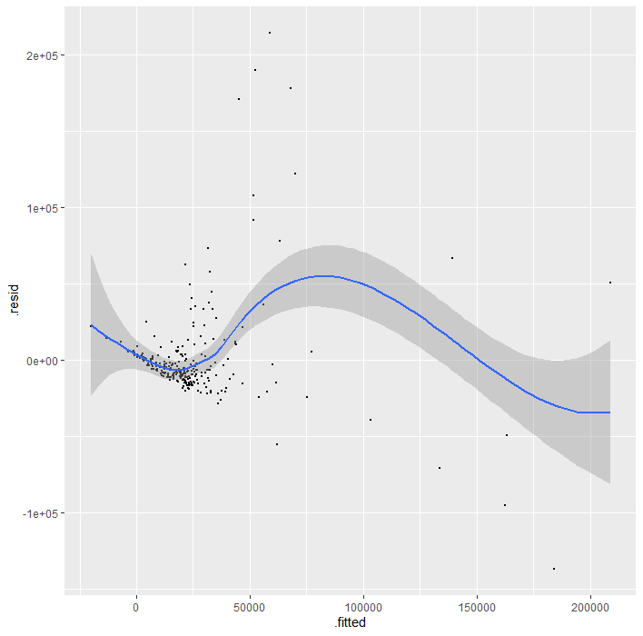
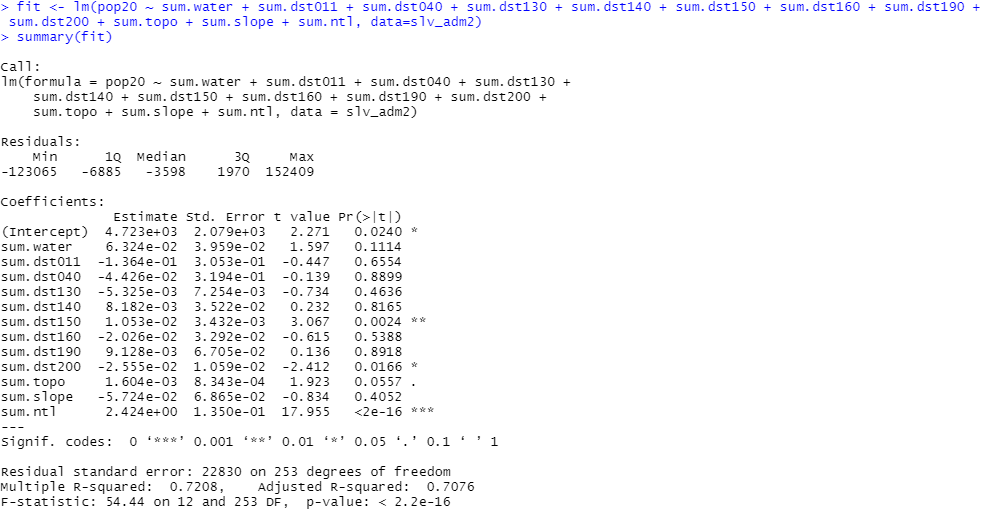

# Project 3

## Challenge 1

## Challenge 2

### Regress the data from two variables against each other and see the relationship between them by checking R^2.

### More variables added to see the effects R^2.

### Finally, add all of the variables to the regression model to compare the results.

