# Project 4: Modeling/Predicting Spatial Values & Investigating and Comparing Results

## Part 1 

### Albania
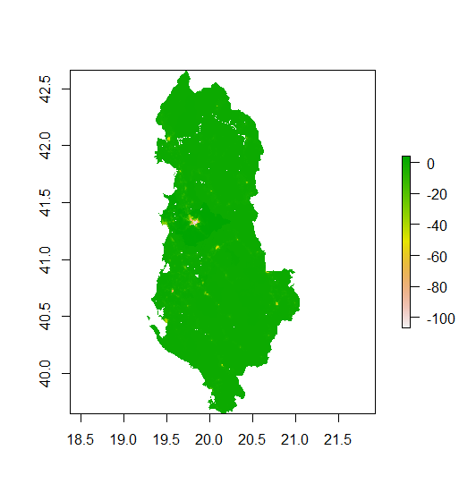

### Tiranë
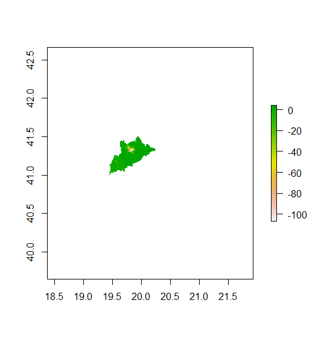

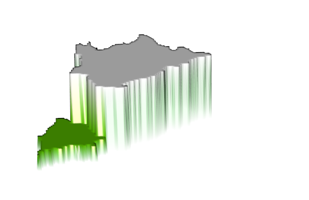

## Part 2

### Predicted sum of population

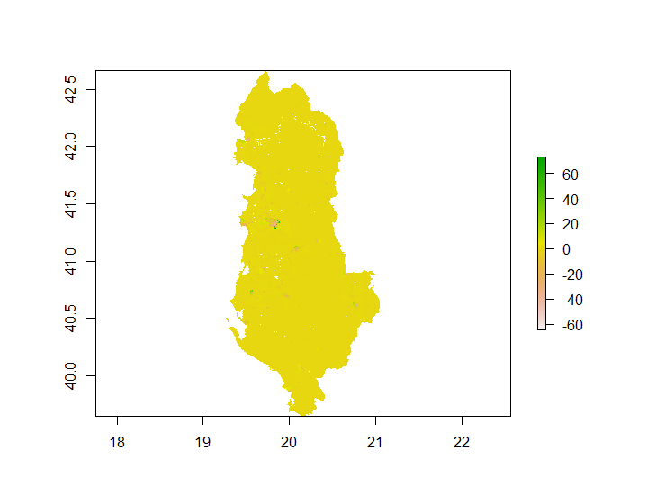
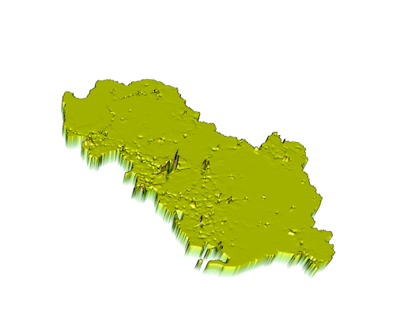

### Predicted mean of population
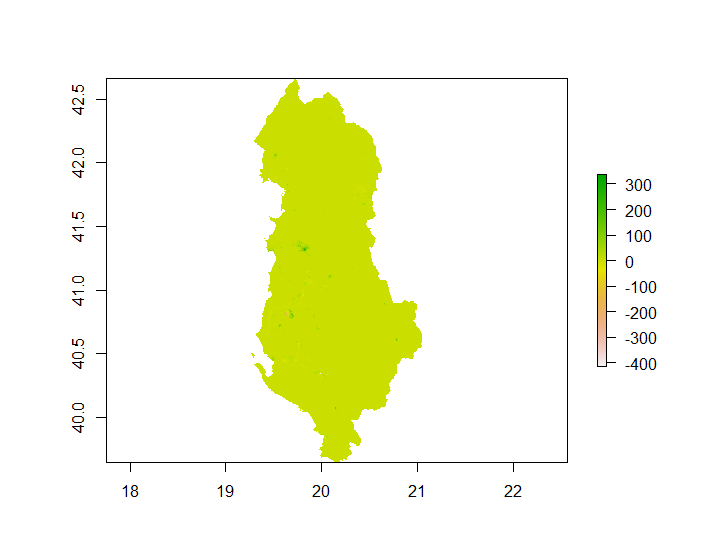
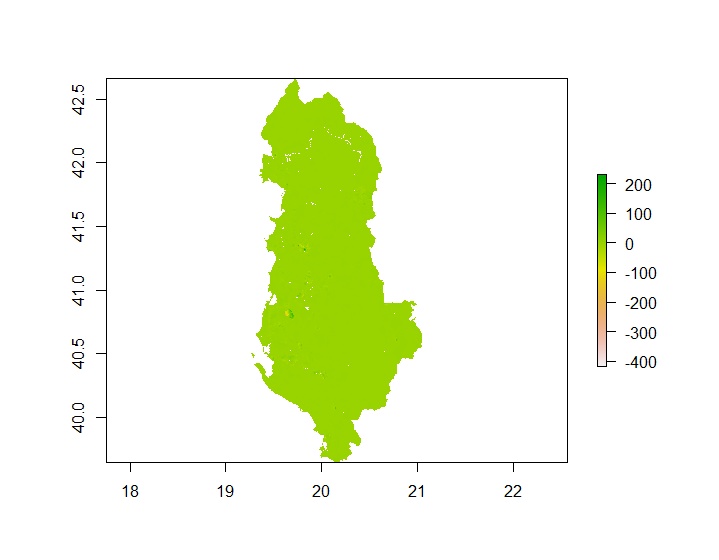
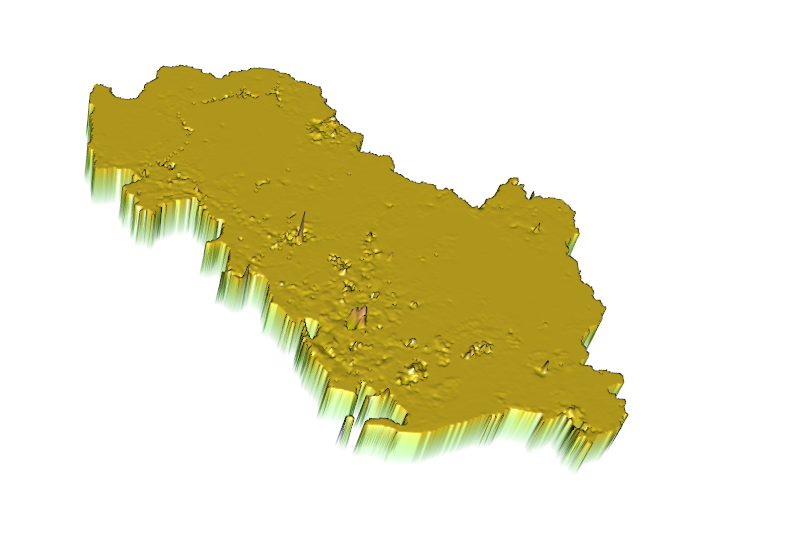

### Predicted log of population
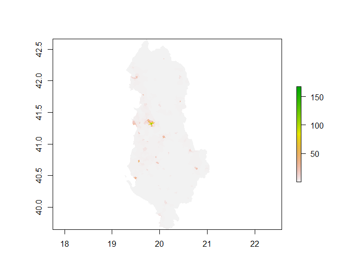
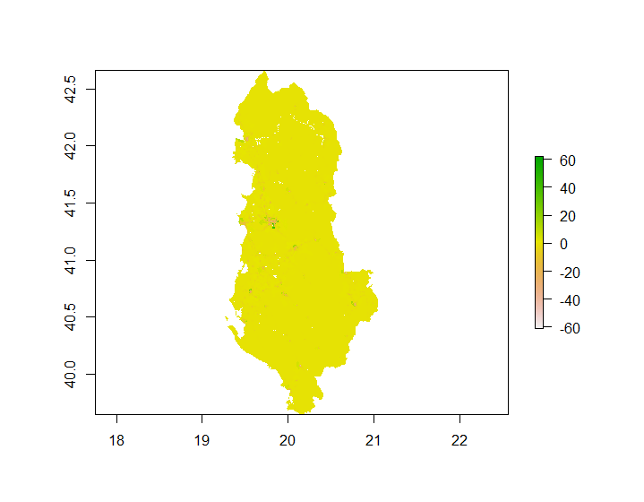
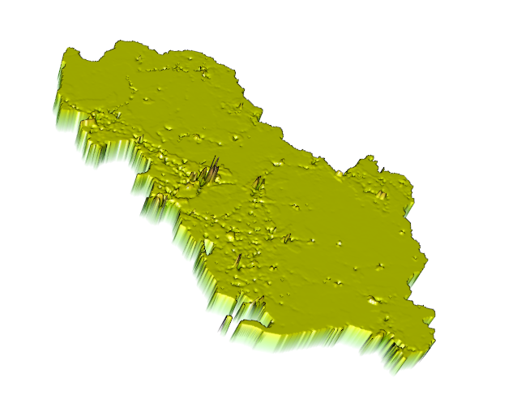
