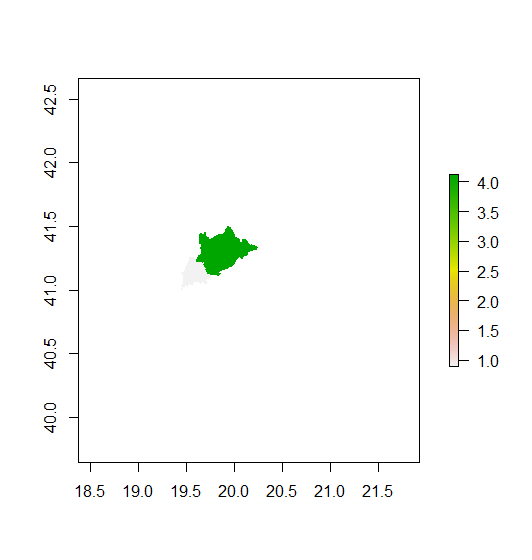

# Project 4: Modeling/Predicting Spatial Values & Investigating and Comparing Results

## Part 1 

### Albania

### Tiranë

## Part 2

### Predicted sum of population

### Predicted mean of population

### Predicted log of population

